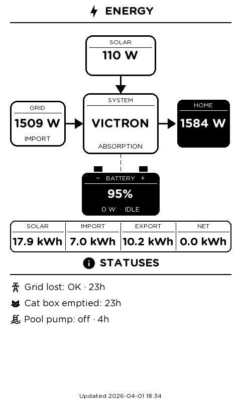

# eink-dashboard

An AppDaemon app for Home Assistant that renders a configurable dashboard as a 480×800 portrait image for e-paper displays, for instance a Waveshare 7.5" V2 driven by an ESP32.

## Overview

The app generates one or more 480×800 portrait images on a configurable interval. Each image is saved as both a human-readable PNG and a 1-bit BIN file. The ESP32 fetches the BIN over HTTP and writes it directly to the display buffer.

The layout is fully driven by a `pages:` list in the config. Each page is a vertical stack of components rendered top to bottom.

## Suggested Hardware

- Waveshare 7.5" e-Paper HAT V2 (800×480, UC8179 controller, model `7.50inV2alt` in ESPHome)
- ESP32

## Screenshot



## Setup

### AppDaemon

Place `eink_dashboard.py` in your AppDaemon `apps/` directory and add a config file:

```yaml
eink_dashboard:
  module: eink_dashboard
  class: EinkDashboard
  out_dir: /homeassistant/www
  fonts_dir: /path/to/fonts
  render_interval: 60        # seconds, default 60
  show_timestamp: true       # show "Updated YYYY-MM-DD HH:MM" footer, default true

  pages:
    - components:
        - type: power_diagram
          system_label: MY SYSTEM
          sensors:
            solar:          sensor.solar_power
            grid:           sensor.grid_power          # positive=import, negative=export
            battery:        sensor.battery_power       # negative=charging, positive=discharging
            batt_soc:       sensor.battery_soc
            load:           sensor.home_load
            inverter_state: sensor.inverter_state
            grid_lost:      sensor.grid_lost_alarm     # state "Alarm" triggers LOST indicator

        - type: energy_strip
          sensors:
            solar_today:  sensor.solar_today
            import_daily: sensor.grid_import_daily
            export_daily: sensor.grid_export_daily

        - type: section_header
          title: STATUSES
          icon: "\uF02FC"

        - type: status_list
          items:
            - icon: "\uF0350"
              label: Grid lost
              entity: sensor.grid_lost_alarm
              value: alarm_elapsed
            - icon: "\uF044F"
              label: Cat box emptied
              entity: input_datetime.cat_box_last_emptied
              value: elapsed
            - icon: "\uF0182"
              label: Pool pump
              entity: switch.pool_pump
              value: on_off_elapsed
```

If any entity is unavailable at render time, an error screen listing the affected entities is shown on page 0 instead.

### Fonts

The app uses [Gotham Rounded](https://www.typography.com/fonts/gotham-rounded) (Bold + Book) and [Material Design Icons](https://github.com/Templarian/MaterialDesign-Webfont). Place the TTF files in the `fonts_dir`:

- `GothamRnd-Bold.ttf`
- `GothamRnd-Book.ttf`
- `materialdesignicons-webfont.ttf`

## Components

All components are stacked vertically. Each receives the current y position and returns the y position after itself.

### `power_diagram`

Renders the power flow diagram: solar, grid, system, home load, and battery with directional arrows indicating active flow. Always intended as the first component on a page.

```yaml
- type: power_diagram
  system_label: VICTRON       # label shown inside the system box
  sensors:
    solar:          sensor.solar_power
    grid:           sensor.grid_power
    battery:        sensor.battery_power
    batt_soc:       sensor.battery_soc
    load:           sensor.home_load
    inverter_state: sensor.inverter_state
    grid_lost:      sensor.grid_lost_alarm
```

Box fill convention: **white** = actively contributing power (solar producing, grid importing, battery discharging). **Black** = idle or consuming.

### `energy_strip`

Renders a four-column strip showing today's solar yield, grid import, grid export, and net consumption in kWh.

```yaml
- type: energy_strip
  sensors:
    solar_today:  sensor.solar_today
    import_daily: sensor.grid_import_daily
    export_daily: sensor.grid_export_daily
```

### `section_header`

Renders a centred title with an optional MDI icon and a full-width underline.

```yaml
- type: section_header
  title: STATUSES
  icon: "\uF02FC"    # optional
```

### `status_list`

Renders a vertical list of icon + label + value rows. Typically placed after a `section_header`.

```yaml
- type: status_list
  items:
    - icon: "\uF0350"
      label: My entity
      entity: sensor.something
      value: elapsed          # see value types below
```

**Value types:**

| Type | Description |
|---|---|
| `elapsed` | Time since last state change: `5m`, `2h`, `3d` |
| `on_off_elapsed` | `on · 5m` or `off · 2h` |
| `alarm_elapsed` | `for 5m` if state is `Alarm`, otherwise `OK · 2h` |
| `state` | Raw HA state (default) |

### `divider`

Renders a horizontal rule.

```yaml
- type: divider
  spacing: 10    # total vertical space consumed, default 10
```

### `section_header` (no icon)

Omit the `icon` key to render a text-only header.

## Multiple pages

Define multiple pages under `pages:`. Each page renders to `eink_pageN.png` and `eink_pageN.bin` (0-indexed).

```yaml
pages:
  - components:
      - type: power_diagram
        ...

  - components:
      - type: section_header
        title: CLIMATE
      - type: status_list
        items: ...
```

The ESP32 side needs to know how many pages exist and cycle through them accordingly.

## Output files

Each page writes two files to `out_dir`:

| File | Description |
|---|---|
| `eink_pageN.png` | Portrait RGB PNG for debugging |
| `eink_pageN.bin` | Landscape 1-bit buffer, ready for ESP direct write |

The BIN is rotated 90° CW and thresholded at 128. No XOR inversion — the Waveshare V2 driver inverts the buffer itself.
